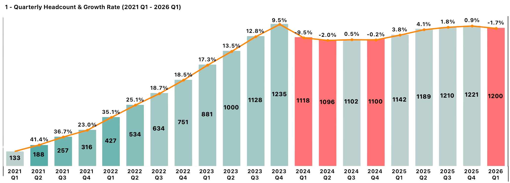
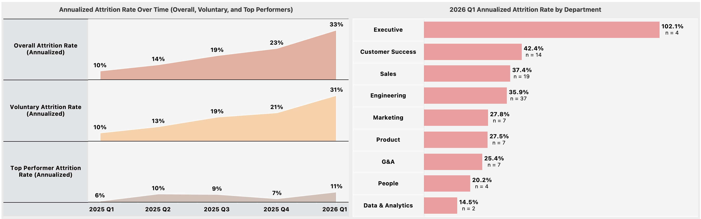
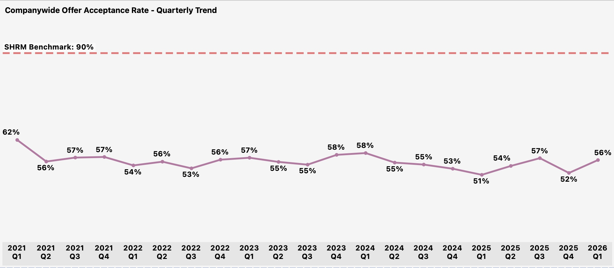

# JustKaizen AI: People Analytics Insights

Built on the data infrastructure published in the companion repository: **[People Analytics Data Infrastructure](https://github.com/keenanj-analytics/people-analytics-data-infrastructure)**

---

## Recap: Company Background

JustKaizen AI is an enterprise AI company that builds intelligent automation for mid-market and enterprise organizations to streamline business operations, analytics, and decision-making workflows.

Founded in 2018 as a remote-first startup, JustKaizen grew from a 15-person team to over 1,200 employees in under 6 years, fueled by 5 rounds of venture funding totaling $360M at a $2.5B valuation.

As the company scaled rapidly, workforce data became fragmented across five disconnected systems -- HRIS, ATS, compensation, performance, and engagement surveys -- resulting in manual data transformation, inconsistent reporting, and no single source of truth on workforce health. Leadership couldn't reliably answer basic questions: Where is attrition spiking? Are we paying equitably? Which recruiting channels produce the best hires?

The CHRO tasked me with building the data infrastructure to answer these questions and providing signal on workforce health, investment priorities, and a streamlined reporting pipeline to track outcomes.

Here are the results:

---

## Executive Summary

### Headcount

JustKaizen's workforce declined by 2% in Q1 2026 due to higher than normal attrition, reversing the recovery trajectory and falling short of the 3% annual growth target.

After three years of hypergrowth (133 to 1,235 employees, 110% CAGR from 2021 to 2023), a reduction in force in early 2024, and a recovery year in 2025, the company entered 2026 with a target of 3% headcount growth. Instead, headcount declined 1.7% in Q1 2026, dropping from 1,221 to 1,200. [Full Headcount Growth Report →](docs/01_headcount_growth.md)

### Attrition

The root cause is attrition. Overall attrition rate grew to 33% (annualized) in 2026 Q1 from 23%; driving up the company's TTM attrition rate by 6 pp. This is mainly driven by a spike in voluntary attrition.

Top performer attrition rate also increased to 11% (annualized) from 7% the previous quarter. While Executive has the highest department attrition rate, its small sample size skews the number; the more meaningful signal is in the three largest revenue-generating functions: Customer Success (42%), Sales (37%), and Engineering (36%). [Full Attrition Report →](docs/02_attrition.md)

### Hiring Pipeline

JustKaizen's offer acceptance rate has hovered in the 51-62% range for five years, well below the SHRM benchmark of 90%. The company is generating candidates but losing nearly half at the offer stage.

Engineering, the largest department and the one losing the most people, has a 50% offer acceptance rate. Average time-to-fill sits at 49 days, consistently above the typical industry range of 25-42 days. [Full Hiring Pipeline Report →](docs/03_hiring.md)

### Compensation

Compensation is internally equitable but externally uncompetitive. The org-wide average compa-ratio is 1.00, every level group is at 1.00, and pay equity across gender and race is strong.

But Engineering and Customer Success both sit at 0.99 -- the same departments with the highest attrition and lowest offer acceptance. The problem is not how employees are paid relative to their bands, but where the bands are set relative to the external market. [Full Compensation Report →](docs/04_compensation.md)

### Engagement

Org-wide eNPS has held steady at 57, but department-level scores vary widely. Customer Success has the second-highest eNPS (71) despite having the highest attrition -- employees are engaged but leaving for external reasons.

Sales has the lowest engagement scores across nearly every theme (3.4-3.6 range), consistent with the manager-driven attrition signal. The weakest themes org-wide -- Career Growth, Recognition, and Communication -- map directly to the top voluntary termination reasons. [Full Engagement Report →](docs/05_engagement.md)

### Performance

The performance rating distribution is healthy (55% Meets Expectations, clean bell curve) with 31% of active employees classified as top performers.

Top talent is concentrated in Engineering (n=126) and Sales (n=58) -- the same departments experiencing elevated attrition. The question is not whether the distribution is healthy, but whether the company is retaining the talent it has identified as most valuable. [Full Performance Report →](docs/06_performance.md)

---

## Report Navigation

1. **[Headcount Growth](docs/01_headcount_growth.md)** -- Is the organization growing at a healthy rate? Where is growth concentrated? 4 charts covering quarterly headcount trends, hires vs. terminations, and department/sub-department breakdowns.

2. **[Attrition](docs/02_attrition.md)** -- Are we losing people faster than we should be? Are we losing the right or wrong people? 6 charts covering attrition trends, department and sub-department rates, top performer attrition, and termination reasons.

3. **[Hiring Pipeline](docs/03_hiring.md)** -- Are we filling roles fast enough? Where is the pipeline breaking down? 4 charts covering offer acceptance rates, time-to-fill trends, and department-level comparisons.

4. **[Compensation](docs/04_compensation.md)** -- Are we paying equitably within peer cohorts? Where are compa-ratio outliers? 5 charts covering compa-ratios by department, level, gender, race, and band outliers.

5. **[Engagement](docs/05_engagement.md)** -- Which teams are engaged and which are disengaging? What themes are driving the gap? 3 charts covering eNPS trends, department eNPS, and theme scores by department.

6. **[Performance](docs/06_performance.md)** -- Is our rating distribution healthy or inflated? Where is top talent concentrated? 4 charts covering rating distribution, top performer concentration, and average ratings by department.

---

## About

Analysis by **[Keenan Artis](https://www.linkedin.com/in/keenanjeffreyartis/)**, an analytics engineer with 7+ years across forensics analytics (PwC) and people analytics. This analysis is modeled after executive workforce reviews delivered to CHROs and People Leadership Teams at a 1,200-person tech company, adapted for portfolio presentation. All data is synthetic; all analytical frameworks, business logic, and interpretive narratives are original work by the author.
