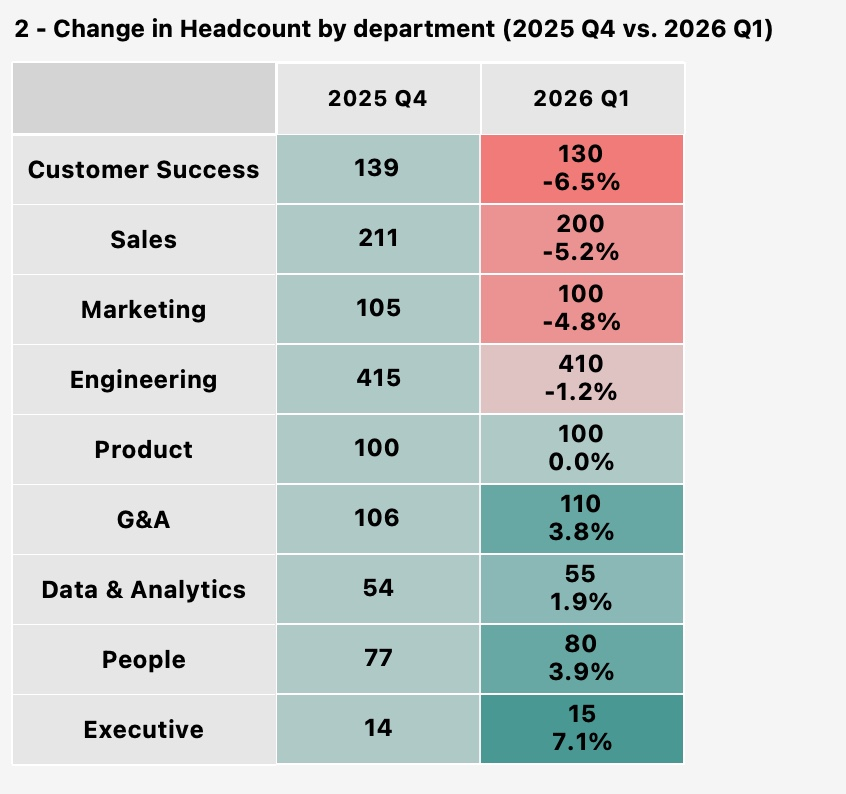
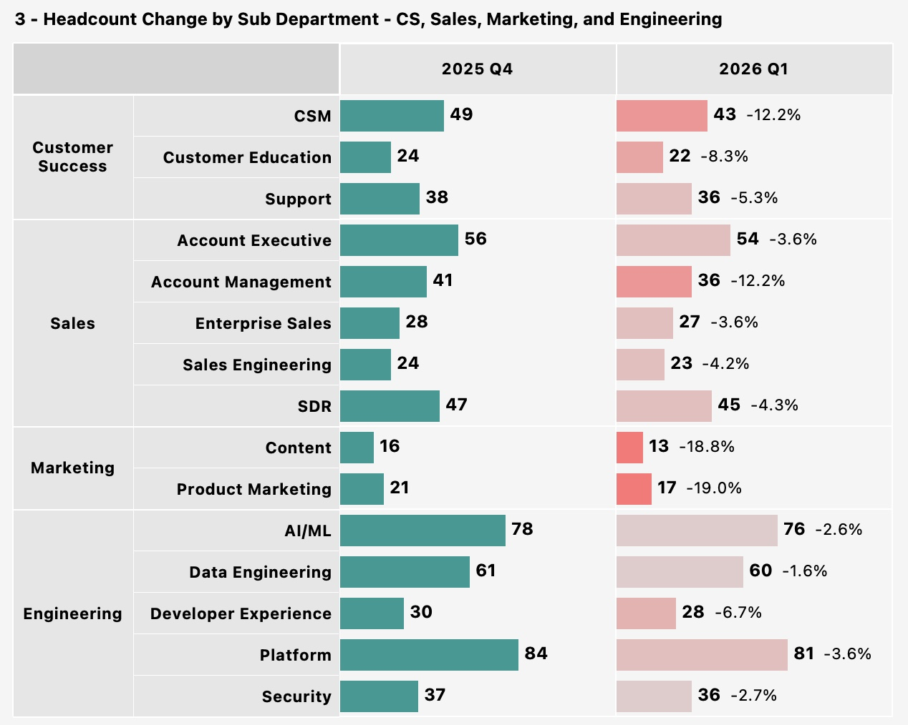
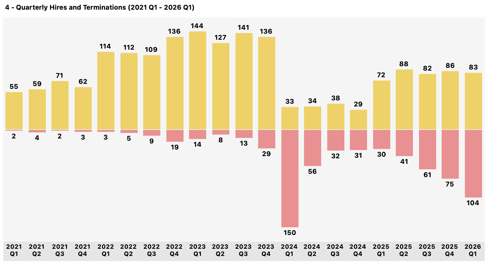

# 1. Workforce Composition

**Question:** Is the organization growing at a healthy rate? Where is growth concentrated?

---

## Key Findings

**JustKaizen's headcount declined 1.7% in Q1 2026, reversing the recovery trajectory and falling short of the 3% annual growth target.** The decline is concentrated in three revenue-generating departments -- Customer Success, Sales, and Marketing -- where attrition is outpacing hiring. At the current pace, JustKaizen will end 2026 below its target of 1,258 employees unless hiring velocity increases or attrition is addressed.

---

## The Growth Arc

*\*2024 Q1 decline reflects a planned reduction in force (150 employees), not organic attrition. Engineering (40), Sales (35), and Marketing (20) absorbed the largest cuts.*

JustKaizen's workforce has moved through four distinct phases: hypergrowth from 2021-2023 (133 to 1,235 employees, 110% CAGR), a reduction in force in Q1 2024 that dropped headcount 9.5% to 1,118, a recovery year in 2025 that restored headcount to 1,221, and an unexpected 1.7% decline in Q1 2026 to 1,200. The company's target of 3% annual growth (1,258 by year-end 2026) is now at risk.

---

## Where the Decline is Concentrated

The decline is isolated to customer-facing, revenue-generating functions. Customer Success (-6.5%), Sales (-5.2%), and Marketing (-4.8%) account for the entire net headcount loss. Meanwhile, G&A, People, and Executive are growing. This is not an org-wide contraction -- it is a targeted talent drain in the departments closest to revenue.

### Sub-Department Detail

The steepest drops are in specialized, high-impact teams. Product Marketing (-19%) and Content (-18.8%) each lost nearly 1 in 5 employees in a single quarter. CSMs (-12.2%) and Account Management (-12.2%) carry direct revenue exposure -- CSMs hold account portfolios and Account Managers own renewal pipelines. Every Engineering sub-department declined, with the losses spread broadly rather than concentrated in one team.

---

## Why This Matters

The headcount decline is not a budgeting problem. JustKaizen hired 83 employees in Q1 2026, but 104 left in the same quarter -- a net loss of 21. This is the first quarter since the 2024 Q1 RIF where terminations outpaced hires. Outside of the RIF, the company had never experienced this. This is an attrition problem masquerading as a growth problem.

---

## Recommended Actions

1. **Prioritize backfill hiring in Customer Success and Sales.** These are the two departments where headcount loss has the most immediate revenue impact. Focus recruiting capacity on CSM, Account Management, and Product Marketing roles.
2. **Investigate why these departments are losing people.** The workforce composition data shows *where* the problem is, but the *why* lives in the attrition analysis ([Section 2](02_attrition.md)). The answer is not headcount planning -- it is retention.
3. **Reforecast the 2026 headcount target.** At the current trajectory (Q1 annualized: -6.8%), JustKaizen would end 2026 at approximately 1,138 employees, 120 below target. The People team should present a revised forecast to leadership that accounts for current attrition trends and realistic hiring capacity.

---

*Data source: fct_workforce_composition, fct_employee_roster. Headcount is measured as active employees at end of month/quarter. Growth rates are calculated as (end / start - 1).*
