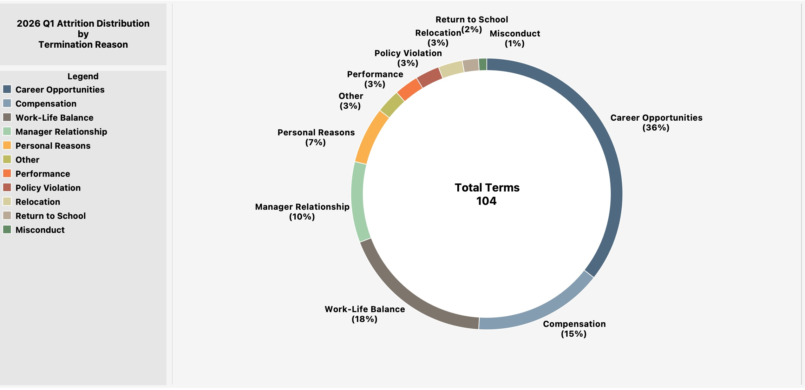
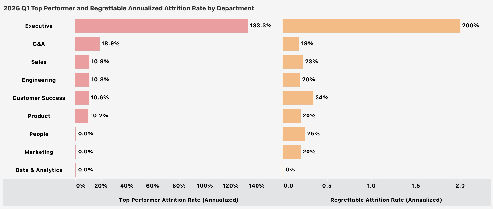

# 2. Attrition

**Question:** Are we losing people faster than we should be? Are we losing the right or wrong people?

---

## Key Findings

**JustKaizen is losing people at an accelerating rate, and over half of those losses are regrettable.** The 3-month annualized attrition rate reached 33.4% in Q1 2026, more than triple the rate from one year ago. The 12-month trailing rate stands at 22.2%, confirming this is a sustained trend and not a seasonal blip. Of 104 departures in Q1 2026, 54 (52%) were regrettable and 27 (26%) were top performers. The problem is most acute in Customer Success, Sales, and Engineering -- the same three departments driving the headcount decline.

---

## Attrition Trend

The TTM rate provides the structural view: attrition has roughly doubled every 12 months since 2024 Q2, rising from 8.2% to 22.2%. The R3M annualized rate shows the recent acceleration -- the current quarter is running at 33.4%, a pace that would mean losing one-third of the workforce if sustained for a full year. For context, the tech sector median for voluntary attrition is typically 13-15% annually. JustKaizen's TTM voluntary rate of 21.1% is already well above industry norms, and the quarterly pace suggests it is still accelerating.

---

## Where Attrition is Concentrated

Customer Success (42%), Sales (37%), and Engineering (36%) are running at annualized rates that would turn over a third or more of each department in a year. These are the same three departments driving the headcount decline identified in [Section 1](01_workforce_composition.md). The pattern is consistent: revenue-generating and product-building functions are losing people fastest, while G&A, People, and Executive are comparatively stable.

---

## Sub-Department Deep Dive

The sub-department view reveals the sharpest pain points. CSMs are leaving at a 63.6% annualized rate (n=7), which would turn over the entire team in under two years. Customer Education (52.9%) and Account Management (53.6%) follow closely. In Engineering, the losses are broad-based -- every sub-department from DevOps & SRE (46.2%) down to Security (22.2%) is bleeding talent, with Career Opportunities as the universal top reason. The Sales pattern is distinct: Account Management (53.6%) is driven by Manager Relationship issues rather than career growth, pointing to a localized leadership problem rather than a systemic one.

---

## Why People Are Leaving

Career Opportunities is the top reason at 36%, followed by Work-Life Balance (18%) and Compensation (15%). When employees consistently cite career growth as the reason for leaving, it typically signals one of three things: the internal promotion pipeline is too slow, the role has limited scope for growth, or competitors are offering titles and responsibilities that JustKaizen is not. This is a structural retention problem, not individual dissatisfaction.

---

## Who We're Losing: Top Performer and Regrettable Attrition

The Executive team stands out at 133% top performer attrition and 200% regrettable attrition (annualized) -- small absolute numbers but structurally destabilizing. Among larger departments, Customer Success has the highest regrettable attrition rate (34%), followed by People (25%), Sales (23%), and Engineering/Marketing/Product (20% each). More than half of all Q1 departures (52%) were classified as regrettable, and 26% were top performers. At the Director level, one-third of departures were top performers. These are the hardest roles to backfill and the most disruptive to lose.

---

## Recommended Actions

1. **Conduct stay interviews in Customer Success and Engineering.** These two departments have the highest regrettable attrition rates among large teams. The data says "career opportunities" is the reason -- stay interviews will reveal what specific opportunities are pulling people away and what JustKaizen would need to offer to compete.

2. **Audit the management layer in Sales, specifically Account Management.** Manager Relationship as the top reason at 26% is an outlier relative to the rest of the org (10%). This suggests a localized leadership problem that can be addressed through coaching, reassignment, or structural changes.

3. **Review Engineering compensation against market data.** Engineering's compa-ratio of 0.992 combined with Career Opportunities as the universal departure reason and a 50% offer acceptance rate all point to the same conclusion: the compensation package is not competitive. See [Section 4: Compensation](04_compensation.md) for detail.

4. **Build career progression frameworks for CSM and SDR roles.** These are high-attrition, early-career roles where the top reason for leaving is career opportunities. A visible promotion path (CSM to Senior CSM to CS Manager, SDR to AE) with defined timelines and criteria would directly address the retention driver.

5. **Present the regrettable attrition rate to leadership as the primary workforce metric.** Overall attrition rate includes departures the company is comfortable with. The 52% regrettable rate isolates the problem to its most actionable form: more than half the people leaving are people the company wants to keep.

---

*Data source: fct_attrition_reporting, fct_employee_roster. TTM = trailing twelve-month rate. R3M Annualized = 3-month terminations / 3-month average headcount, multiplied by 4 to project an annual rate. Regrettable classification is assigned at time of termination by the departing employee's manager. Top performer = most recent performance rating of 4+ or critical talent flag.*
