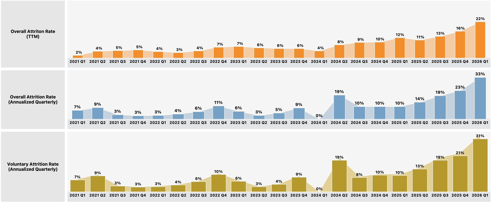
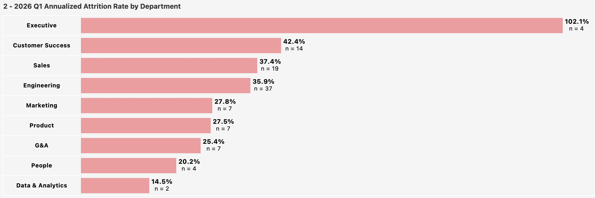
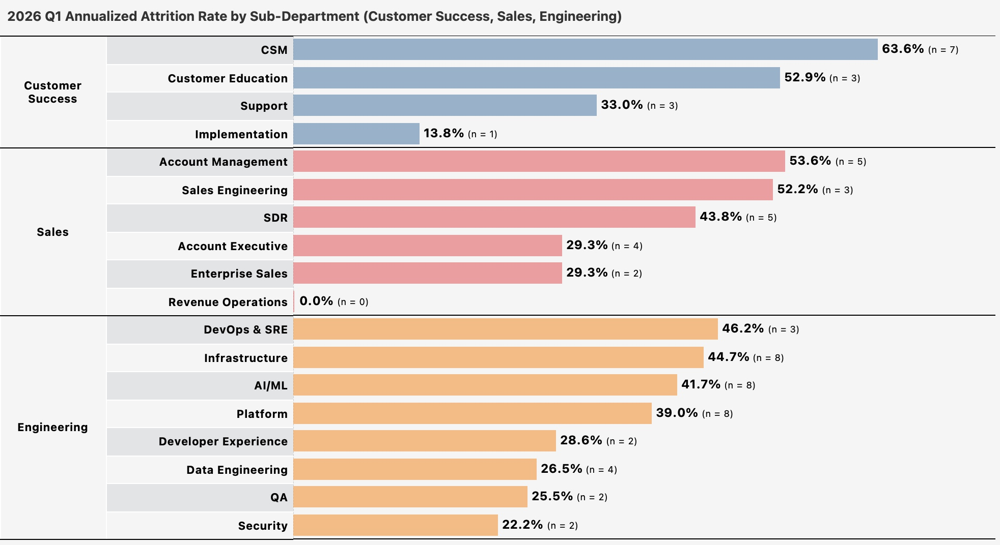
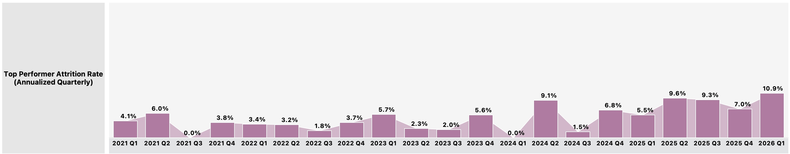
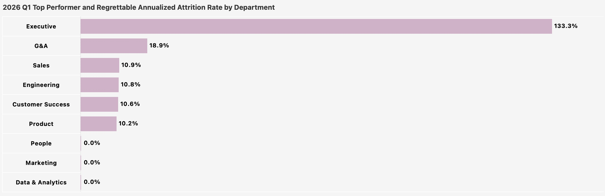

# 2. Attrition

**Question:** Are we losing people faster than we should be? Are we losing the right or wrong people?

---

## Summary of Findings

1. 2026 Q1 TTM Overall Attrition Rate grew to 33% in 2026 Q1 from 23% in the previous quarter. This is mainly driven by a spike in voluntary attrition (31% annualized, Q1).
2. 2026 Q1 Attrition is most concerning in revenue generating functions: Customer Success (42%), Sales (37%), and Engineering (36%). 8 sub-departments within these functions have an annualized voluntary attrition rate greater than 40%.
3. 2026 Q1 Annualized Top Performer Attrition Rate increased to 11% from 7% the previous quarter. Top Performer Attrition is most elevated in G&A (18.9% annualized) followed by Sales, CS, Eng, and Product each with a 10-11% annualized rate.
4. In 2026 Q1, the top reasons for terminations are Career Opportunities (36%), Work-Life Balance (18%), and Compensation (15%)

---

## 1 - Overall Attrition Rate grew to 33% (TTM) in 2026 Q1 from 23% in the previous quarter. This is mainly driven by a spike in Voluntary Attrition (31% from 21% annualized)

---

## 2 - 2026 Q1 Annualized Attrition Rate is most elevated in Customer Success (42%), Sales (37%), and Engineering (36%)

*Note: The annualized rate for "Executive" is 102%. Though this will be noted for investigation, its sample size triggers the rate heavily and has less of an impact on the org-wide overall rate.*

Within these revenue generating functions, 8 sub-departments have annualized voluntary attrition rates greater than 40%: CSM (64%), Customer Education (53%), Account Management (54%), Sales Engineering (52%), SDRs (44%), DevOps (46%), Infrastructure (45%), and AI/ML (42%)

---

## 3 - 2026 Q1 Annualized Top Performer Attrition Rate increased to 11% from 7% the previous quarter

Top Performer Attrition is most elevated in G&A (18.9% annualized) followed by Sales, CS, Eng, and Product each with a 10-11% annualized rate.

---

## 4 - In 2026 Q1, the top reasons for terminations are Career Opportunities (36%), Work-Life Balance (18%), and Compensation (15%)

---

[← Previous: Headcount Growth](01_headcount_growth.md) | [Back to Report Summary](../README.md) | [Next: Hiring Pipeline →](03_hiring.md)
