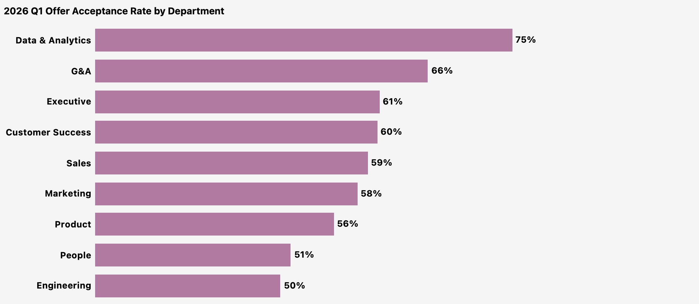
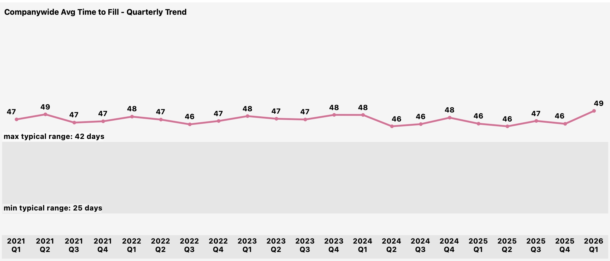
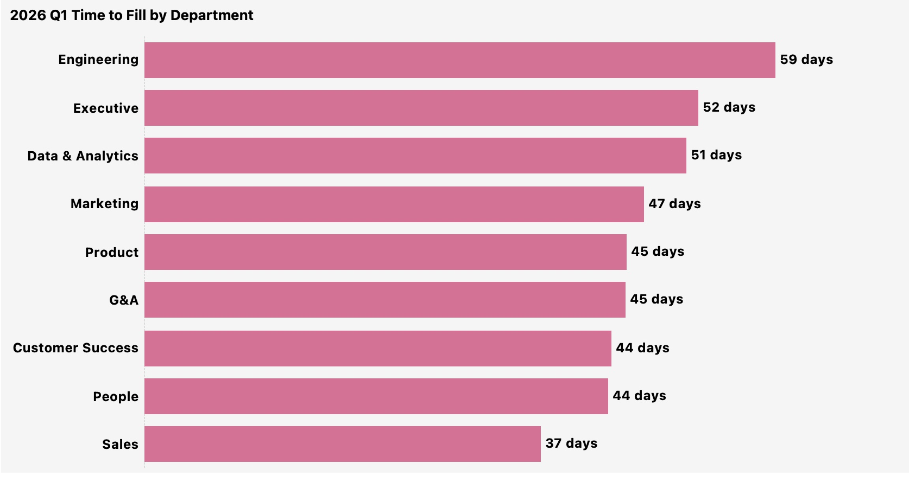

# 3. Hiring Pipeline

**Question:** Are we filling roles fast enough? Where is the pipeline breaking down?

---

## Key Findings

**JustKaizen's hiring pipeline has a conversion problem, not a volume problem.** The company's offer acceptance rate has hovered in the 51-62% range for five years, never once approaching the SHRM benchmark of 90%. Meanwhile, average time-to-fill sits at 49 days, consistently above the typical industry range of 25-42 days. The company is investing recruiting effort to generate candidates, getting them to the offer stage, and then losing nearly half of them at the finish line.

---

## Offer Acceptance Rate

The offer acceptance rate has never broken 62% across the entire data scope. This is not a new problem or a recent decline -- it is a persistent structural gap that has existed since the company began scaling. The SHRM benchmark for a healthy pipeline is 90%. JustKaizen is operating at roughly 56%, meaning for every 10 offers extended, the company loses 4-5 candidates. In a competitive tech talent market, this level of offer loss signals that the total compensation package (base salary, equity, benefits, or role scope) is not competitive with what candidates are receiving elsewhere.

---

## Offer Acceptance by Department

Engineering and Customer Success -- the two departments with the highest attrition -- also have the lowest offer acceptance rates. This creates a compounding talent problem: the departments losing the most people are also the least able to replace them. Engineering extended the most offers of any department in Q1 2026 and closed only half. Customer Success is the lowest in the organization. Combined with the 42% annualized attrition rate from [Section 2](02_attrition.md), CS is in a talent crisis: losing people faster than it can hire, and failing to close half the candidates it does identify.

---

## Time-to-Fill

*Typical range sourced from [The Resource Group, 2025](https://www.theresource.com/2025/10/13/average-time-to-hire/).*

Average time-to-fill has remained between 46 and 49 days across the full data scope, consistently above the typical industry range of 25-42 days. Q1 2026 ticked up to 49 days, the highest point since 2021 Q2. While the trend is stable rather than deteriorating rapidly, the persistent overshoot means JustKaizen is structurally slower to fill roles than the market norm -- every open position carries an extra week or more of vacancy compared to typical benchmarks.

---

## Time-to-Fill by Department

Engineering has the longest time-to-fill, approaching the upper bound of the industry range. Given that Engineering also has the highest volume of hires, this extended timeline has a multiplicative effect: each additional day of vacancy across dozens of open positions represents significant lost productivity. Sales has the fastest time-to-fill, which is expected -- sales roles typically have larger candidate pools, more standardized interviews, and faster decision timelines than technical roles.

---

## The Compounding Problem

The hiring pipeline data does not exist in isolation. When combined with attrition data from [Section 2](02_attrition.md), the picture becomes clear:

**Engineering:** 38 departures in Q1, 33 hires. Net: -5. But only 50% of offers are accepted, meaning Engineering actually needed to extend 66 offers to get those 33 hires. At ~49 days per hire, each backfill represents nearly two months of vacancy. And 53% of those departures were regrettable -- people the company wanted to keep.

**Customer Success:** 15 departures, 6 hires. Net: -9. With a ~46% acceptance rate, CS needed to extend roughly 13 offers to get 6 hires. The department is shrinking because it cannot hire fast enough to offset voluntary attrition.

**Sales:** 19 departures, 8 hires. Net: -11. The largest absolute headcount loss. While Sales has the fastest time-to-fill, the volume gap between departures and hires is too large for speed alone to solve.

---

## Recommended Actions

1. **Conduct a compensation market analysis for Engineering, Customer Success, and Product roles.** These departments have offer acceptance rates at or below 50%. The most likely explanation is that JustKaizen's offers are not competitive with competing offers candidates are receiving. A targeted market analysis will quantify the gap and inform whether base salary, equity, signing bonus, or total package adjustments are needed.

2. **Implement offer loss tracking.** JustKaizen currently records whether an offer was accepted or declined but does not systematically capture *why* candidates decline or *who* they chose instead. Adding a structured "offer decline reason" field (competing offer, compensation, role scope, location, timing) would turn the loss rate from a problem statement into an actionable diagnostic.

3. **Accelerate Engineering hiring timelines.** Engineering's time-to-fill is the longest in the organization and above industry norms. Each day of delay increases the likelihood that the candidate accepts a competing offer. Evaluate whether interview stages can be compressed, whether hiring manager availability is a bottleneck, or whether initial screening criteria are filtering too aggressively.

4. **Set a 6-month target to reach 70% offer acceptance rate.** The current ~56% rate is a structural problem that has persisted for five years. A realistic near-term target of 70% would mean closing 7 of every 10 offers instead of 5.5, translating to approximately 15-20 additional hires per quarter at current offer volume.

---

[← Previous: Attrition](02_attrition.md) | [Back to Report Summary](../README.md) | [Next: Compensation →](04_compensation.md)
