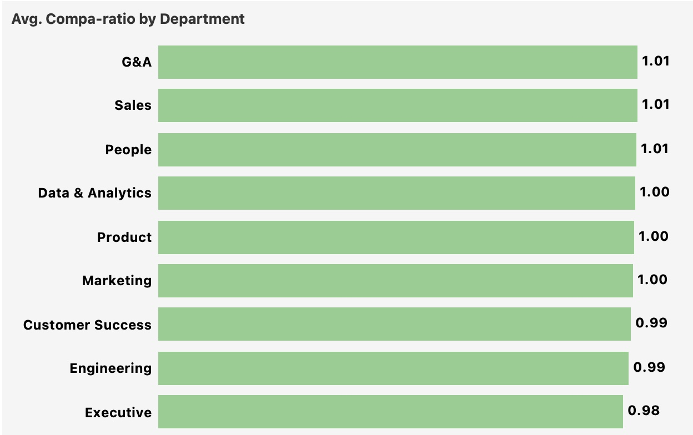
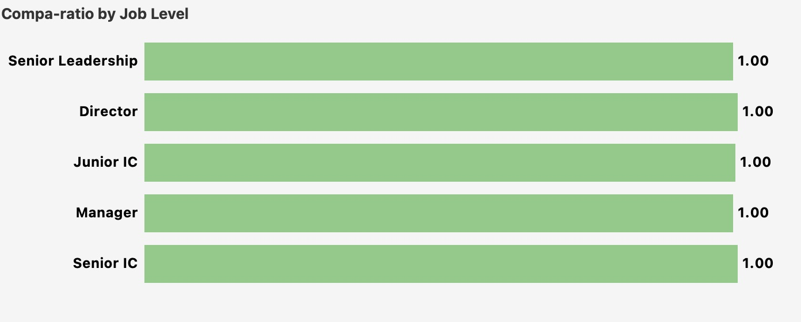
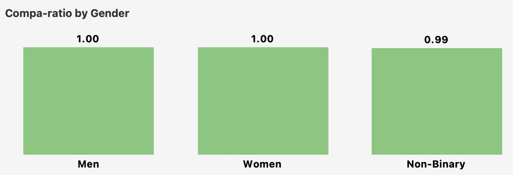

# 4. Compensation

**Question:** Are we paying equitably within peer cohorts? Where are compa-ratio outliers?

---

## Key Findings

**JustKaizen's compensation structure is internally sound but externally uncompetitive.** The org-wide average compa-ratio is 1.00 (exactly at band midpoint), gender equity is strong (Men and Women both at 1.00), and band outliers are nearly nonexistent -- only 3 employees below band and 4 above band across the entire organization. On paper, this is a well-functioning compensation framework. But when cross-referenced with 50% offer acceptance in Engineering, 42% attrition in Customer Success, and Career Opportunities as the #1 departure reason, the conclusion is clear: employees are paid fairly relative to their bands, but the bands themselves are not competitive with what the external market is offering.

---

## Compa-Ratio by Department

The department spread is narrow -- 0.98 (Executive) to 1.01 (G&A, Sales, People). Engineering and Customer Success both sit at 0.99, slightly below midpoint. These are the same two departments with the highest attrition ([Section 2](02_attrition.md)) and the lowest offer acceptance rates ([Section 3](03_hiring.md)). While 0.99 is not alarming in isolation, the pattern matters: the departments closest to revenue and product delivery are the only ones below midpoint.

---

## Compa-Ratio by Level Group

Every level group -- from Junior IC to Senior Leadership -- sits at exactly 1.00. This is a strong signal that the band structure is well-calibrated across the career ladder. There is no systematic underpayment at any level, which means the retention problem is not being driven by pay compression at specific career stages. The issue is not how employees are positioned within bands, but where the bands are set relative to the external market.

---

## Pay Equity: Gender

Men and Women have identical average compa-ratios at 1.00. Non-Binary employees average 0.99, a gap of roughly 1 percentage point. While the Non-Binary population is small (~44 employees, 3.7% of the workforce), a persistent gap of this magnitude warrants investigation. The question is whether this is driven by level mix (Non-Binary employees concentrated in lower-paid roles) or by within-role pay differences. If within-role, it is a correctable equity issue.

---

## Band Outliers

*Outlier thresholds: Below Band = compa-ratio < 0.85. Above Band = compa-ratio > 1.15.*

The outlier picture is remarkably clean. Only 3 employees across the entire organization fall below band (1 each in Customer Success, Engineering, and Marketing), and only 4 sit above band (Product 2, Data & Analytics 1, People 1). This confirms that compensation administration is tight -- managers are not systematically over- or under-positioning employees relative to their bands. The problem is not individual pay decisions. It is structural market positioning.

---

## Cross-Referencing Compensation with Attrition and Hiring

The compensation data becomes most valuable when layered with the attrition findings from [Section 2](02_attrition.md) and hiring findings from [Section 3](03_hiring.md):

**Engineering:** 0.99 compa-ratio + 36% attrition + 50% offer acceptance + Career Opportunities as top departure reason. This is a coherent signal: engineers are paid at band, but the band is not competitive. The company cannot retain current employees or close external candidates. Compensation is a primary lever.

**Customer Success:** 0.99 compa-ratio + 42% attrition + Compensation as #2 departure reason (20%). CSMs specifically are leaving at a 64% annualized rate. If the CSM band midpoint is not competitive with market rates for similar roles, no amount of internal pay equity will solve the retention problem.

**Sales:** 1.01 compa-ratio. Sales is the one high-attrition department where compensation does *not* appear to be a factor. The 37% attrition rate in Sales is driven by Manager Relationship (26%) and Career Opportunities (21%), not pay. This confirms that the Sales retention problem requires a different intervention (see [Section 2](02_attrition.md) recommendations).

---

## Recommended Actions

1. **Benchmark Engineering and Customer Success bands against external market data.** Internal compa-ratios are healthy, but the attrition and offer acceptance data strongly suggest the bands are set below market. A targeted market analysis for these two departments will quantify the gap and inform whether band adjustments are needed.

2. **Investigate the Non-Binary compa-ratio gap.** Determine whether the 0.01 gap is driven by level mix or within-role pay differences. If within-role, correct immediately. If level mix, address through promotion pipeline analysis.

3. **Correct the 3 below-band employees immediately.** With only 3 employees below the 0.85 threshold, this is a trivial cost with outsized retention signal. These employees are demonstrably underpaid relative to the company's own defined competitive range.

4. **Do not pursue a broad-based compensation increase.** The org-wide compa-ratio of 1.00 indicates the band structure is internally sound. The problem is localized to specific departments where external market rates have likely moved ahead of current band definitions. Broad increases would spend budget where it is not needed.

---

[← Previous: Hiring Pipeline](03_hiring.md) | [Back to Report Summary](../README.md) | [Next: Engagement →](05_engagement.md)
