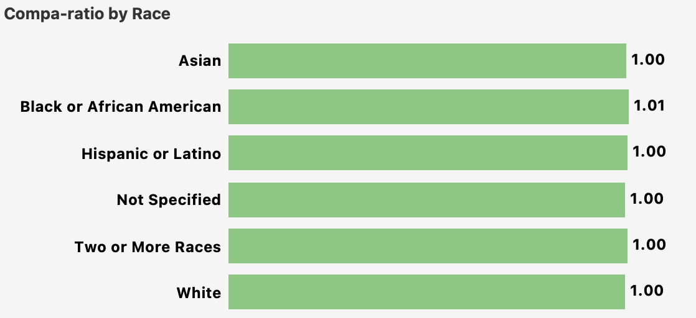
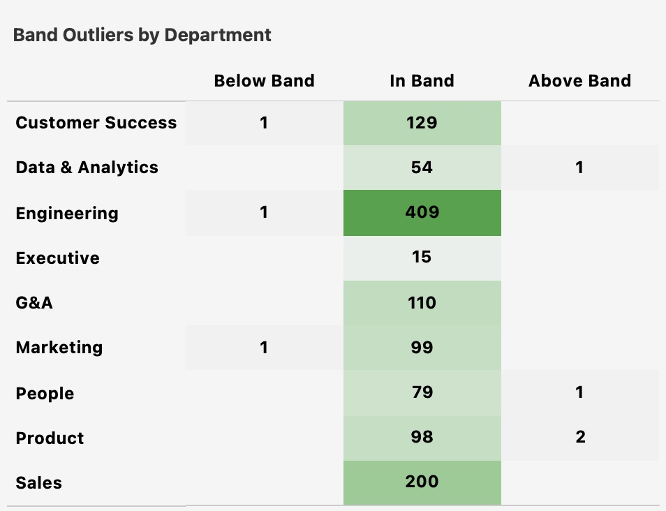

# 4. Compensation

**Question:** Are we paying equitably within peer cohorts? Where are compa-ratio outliers?

---

## Summary of Findings

1. JustKaizen's org-wide average compa-ratio is 1.00 (exactly at band midpoint) with a narrow department spread of 0.98-1.01. Engineering and Customer Success sit at 0.99 -- the same departments with the highest attrition and lowest offer acceptance rates.
2. Every level group sits at exactly 1.00, indicating no systematic underpayment at any career stage. The band structure is well-calibrated internally.
3. Pay equity across gender and race is strong. Men and Women both at 1.00, Non-Binary at 0.99. All racial/ethnic groups at 1.00-1.01.
4. Band outliers are nearly nonexistent -- only 3 employees below band and 4 above band across the entire organization. The compensation problem is not internal equity -- it is external market competitiveness.

---

## 1 - Compa-ratio by department is tightly clustered, but Engineering and Customer Success sit below midpoint

The department spread is narrow -- 0.98 (Executive) to 1.01 (G&A, Sales, People). Engineering and Customer Success both sit at 0.99, slightly below midpoint. These are the same two departments with the highest attrition ([Section 2](02_attrition.md)) and the lowest offer acceptance rates ([Section 3](03_hiring.md)). While 0.99 is not alarming in isolation, the pattern matters: the departments closest to revenue and product delivery are the only ones below midpoint.

---

## 2 - Every level group sits at exactly 1.00 -- no pay compression at any career stage

Every level group -- from Junior IC to Senior Leadership -- sits at exactly 1.00. There is no systematic underpayment at any level, which means the retention problem is not being driven by pay compression at specific career stages. The issue is not how employees are positioned within bands, but where the bands are set relative to the external market.

---

## 3 - Pay equity across gender and race is strong

Men and Women have identical average compa-ratios at 1.00. Non-Binary employees average 0.99, a gap of roughly 1 percentage point. While the Non-Binary population is small (~44 employees, 3.7% of the workforce), a persistent gap of this magnitude warrants investigation to determine whether it is driven by level mix or within-role pay differences.

Compa-ratios across all racial and ethnic groups fall between 1.00-1.01. Black or African American employees sit at 1.01 (slightly above midpoint), while all other groups are at 1.00. There is no meaningful pay gap by race/ethnicity, confirming that the compensation structure is equitable across demographic groups.

---

## 4 - Band outliers are nearly nonexistent -- only 3 below band and 4 above band across 1,200 employees

*Outlier thresholds: Below Band = compa-ratio < 0.85. Above Band = compa-ratio > 1.15.*

Only 3 employees across the entire organization fall below band (1 each in Customer Success, Engineering, and Marketing), and only 4 sit above band (Product 2, Data & Analytics 1, People 1). Compensation administration is tight -- managers are not systematically over- or under-positioning employees relative to their bands. The problem is not individual pay decisions. It is structural market positioning.

---

[← Previous: Hiring Pipeline](03_hiring.md) | [Back to Report Summary](../README.md) | [Next: Engagement →](05_engagement.md)
