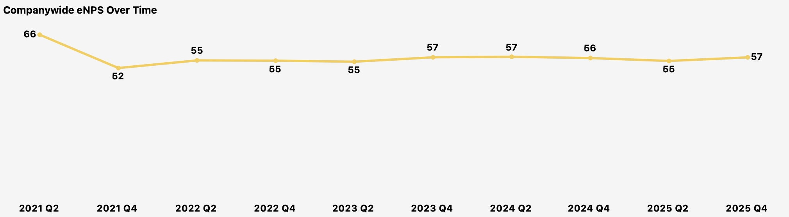
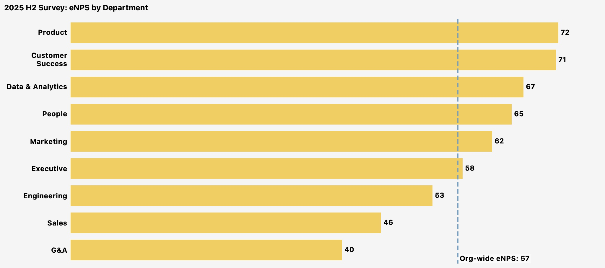
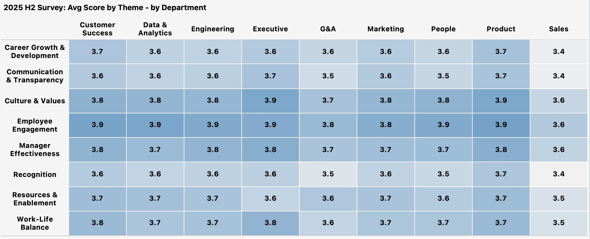

# 5. Engagement

**Question:** Which teams are engaged and which are disengaging? What themes are driving the gap?

---

## Key Findings

**Org-wide engagement is stable but masks significant department-level divergence.** The companywide eNPS has held steady in the 55-57 range since 2022, currently at 57. But beneath that stability, Sales (46) and G&A (40) sit well below the org-wide benchmark, while Customer Success (71) and Product (72) score highest. The paradox: the department with the second-highest eNPS (Customer Success at 71) also has the highest attrition rate (42%). Employees are engaged with their work but leaving for external reasons -- career opportunities and compensation. Meanwhile, Sales is the lowest-scoring department on the theme heatmap across nearly every dimension, consistent with the manager-driven attrition signal from [Section 2](02_attrition.md).

---

## eNPS Trend

The org-wide eNPS dropped from 66 in 2021 H1 to 52 in 2021 H2 -- likely reflecting the rapid scaling pressures of hypergrowth -- then stabilized in the 55-57 range for the past four years. The current score of 57 is healthy by industry standards (above 50 is generally considered "good"), but the flat trajectory means engagement has not improved despite the company's recovery and growth since the 2024 RIF. The score survived the layoff without a major dip, which suggests the restructuring was well-communicated, but it also has not recovered to pre-scale levels.

---

## eNPS by Department

The department spread is wide -- 32 points from G&A (40) to Product (72). Three stories stand out:

**Customer Success at 71 is a paradox.** This is the second-highest eNPS in the organization, yet CS has the highest annualized attrition rate (42%) and the lowest offer acceptance rate. CS employees are not disengaged -- they are undercompensated and underleveraged. They like the work but are leaving for better career opportunities and pay. Engaged employees who leave are the most regrettable losses because they were productive right up to the point of departure.

**Sales at 46 is consistent with the attrition signal.** Sales is the department where Manager Relationship is the #1 attrition reason at 26% (vs. 10% org-wide). The low eNPS confirms this is not just an exit interview talking point -- it is showing up in how current employees feel about the organization.

**G&A at 40 is the lowest despite low attrition and the highest compa-ratio (1.01).** G&A employees are paid well and staying, but they are not enthusiastic. This may reflect role satisfaction or growth ceiling concerns rather than an immediate retention risk.

---

## Theme Scores by Department

The heatmap reveals where specific themes are weakest. Sales scores lowest across nearly every theme (3.4-3.6 range), with Career Growth & Development (3.4) and Communication & Transparency (3.4) as the bottom two. These align directly with the attrition drivers: when employees do not see a career path and do not feel informed, a recruiter's call becomes compelling.

The bottom three themes org-wide -- Recognition, Career Growth & Development, and Communication & Transparency -- all score in the 3.5-3.6 range. These map to the top voluntary termination reasons from [Section 2](02_attrition.md): Career Opportunities (#1 at 36%) and Compensation (#3 at 15%). Low Career Growth scores mean employees feel their development paths are unclear. Low Recognition scores mean they feel their contributions are not valued. Together, these create the conditions that make external offers attractive.

Employee Engagement and Culture & Values score highest across the board (3.6-3.9 range), suggesting employees generally feel connected to the mission and their teams, even in departments experiencing high attrition.

---

## Recommended Actions

1. **Launch a Sales-specific engagement action plan.** Sales is the only department that is both the lowest-engaged and has a unique attrition driver (Manager Relationship). Focus on manager effectiveness within Sales -- 360 feedback, manager coaching, and potentially structural changes to reporting lines in Account Management where attrition is highest.

2. **Address Recognition and Career Growth org-wide.** These are the two lowest-scoring themes and both map to the top attrition reason. Tactical interventions: implement a structured recognition program (peer-to-peer, manager-to-IC), publish career progression frameworks for high-attrition roles (CSM, SDR, Engineer), and increase frequency of career development conversations from annual to quarterly.

3. **Do not over-index on Customer Success engagement scores.** CS scores well on engagement but has the highest attrition rate. The intervention for CS is compensation and career pathing ([Sections 2](02_attrition.md) and [4](04_compensation.md)), not engagement programming.

4. **Investigate G&A engagement drivers.** The lowest eNPS (40) in a department with low attrition and above-midpoint comp suggests a satisfaction or growth ceiling issue. Stay interviews or a targeted pulse survey could reveal whether this is a retention risk or simply a characteristic of the function.

---

*Data source: fct_engagement_trends. eNPS = 100 × (% Promoter - % Detractor) on a 0-10 scale. Theme scores are on a 1-5 Likert scale. Survey data is anonymized at the department level; individual-level engagement scores are not available.*
