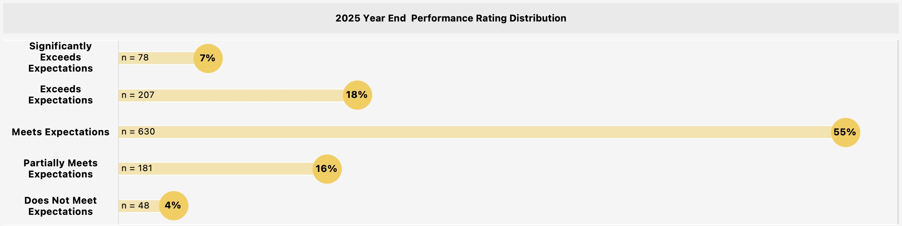
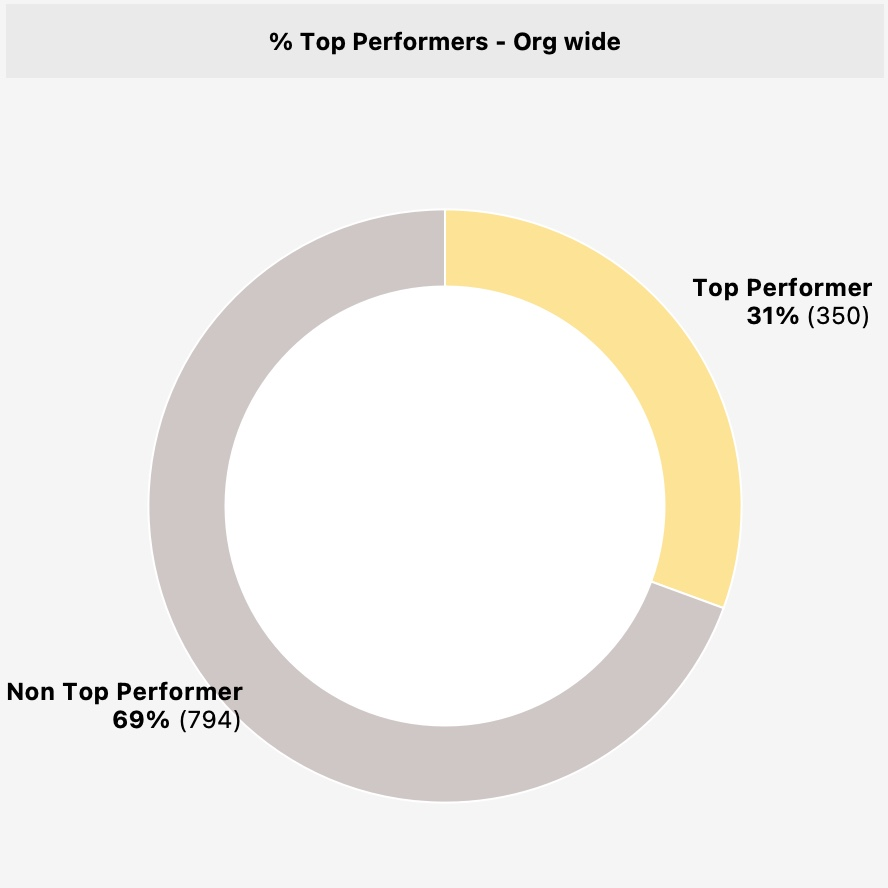
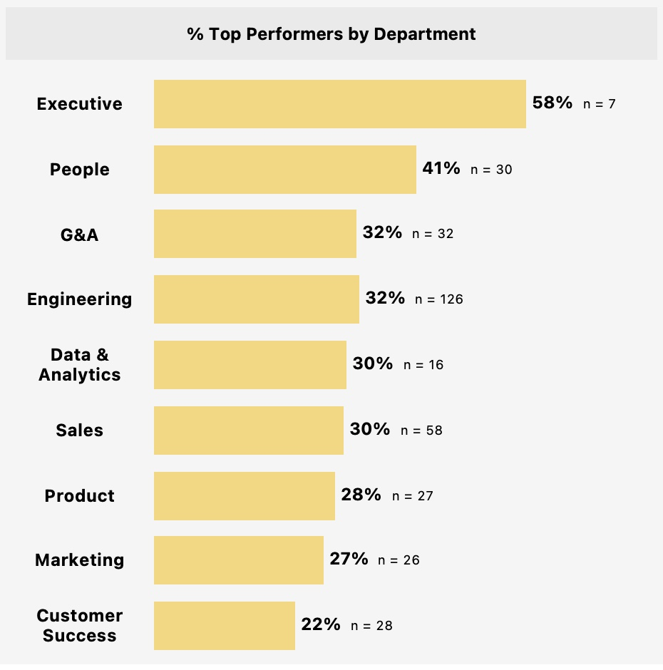
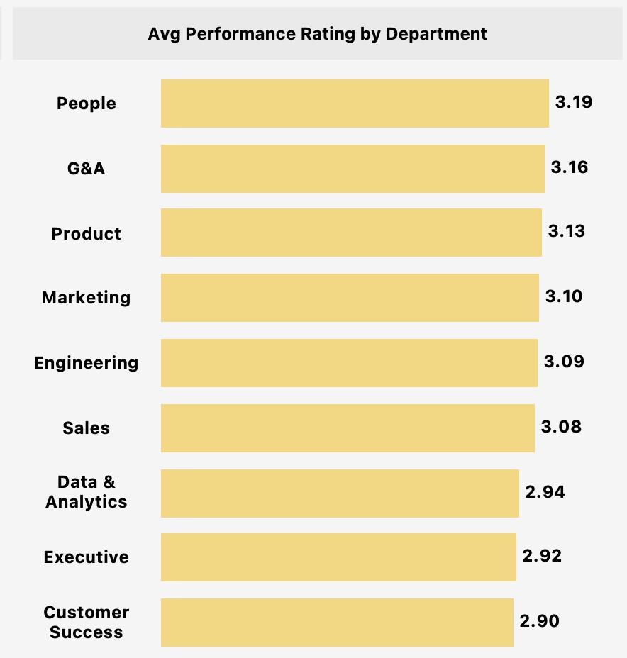

# 6. Performance

**Question:** Is our rating distribution healthy or inflated? Where is top talent concentrated?

---

## Key Findings

**JustKaizen's performance rating distribution is healthy and well-calibrated, with 55% of active employees rated "Meets Expectations" and a clean bell-curve shape.** The 31% top performer rate (350 active employees rated 4+ or flagged as critical talent) creates a tension: nearly one-third of the workforce is classified as high-value talent, yet the company lost 27 top performers in Q1 2026 alone. Top talent is concentrated in Engineering (126 active top performers) and Sales (58), both of which are experiencing elevated attrition. The question is not whether the distribution is healthy -- it is whether the company is retaining the talent it has identified as most valuable.

---

## Rating Distribution

*Distribution reflects active employees only (n = 1,144).*

This is a well-shaped distribution. The 55% concentration at "Meets Expectations" indicates that managers are not inflating ratings -- a common problem in tech companies where 70%+ of employees often receive the top two ratings. The 20% of employees rated below "Meets" (Partially Meets + Does Not Meet) suggests the calibration process is functioning: managers are differentiating performance rather than defaulting everyone to the middle or top. Industry benchmarks from Mercer and WorldatWork suggest a healthy distribution has 50-60% in the middle tier, 20-30% in the top two, and 10-20% in the bottom two. JustKaizen's distribution (25% top, 55% middle, 20% bottom) falls within these ranges.

---

## Top Performer Concentration

350 active employees (31%) are classified as top performers. This is a reasonable rate -- high enough to represent meaningful differentiation, but not so high that the label loses its meaning.

---

## Top Performers by Department

Engineering has the largest absolute pool of top performers (n=126), followed by Sales (n=58). These are also the two largest departments by headcount. The concentration matters because the attrition data from [Section 2](02_attrition.md) shows that Engineering lost 9 top performers and Sales lost 4 in Q1 2026 alone. At that rate, Engineering would lose 36 top performers annually -- nearly 29% of its top talent pool -- purely through voluntary attrition.

Customer Success has the lowest top performer rate at 22%. This could reflect genuine performance distribution differences, or it could indicate that calibration standards in CS are more conservative. Either way, CS also has the lowest average rating (2.90), which may warrant a calibration review to ensure consistency across departments.

---

## Average Rating by Department

The spread from top (People: 3.19) to bottom (Customer Success: 2.90) is 0.29 points -- a narrow range suggesting reasonable cross-department consistency. Customer Success and Executive sitting at the bottom may reflect the structural disruption these departments have experienced (CS headcount decline, Executive turnover at 133% annualized) rather than genuinely lower performance.

---

## The Retention Problem for Top Talent

The performance data becomes urgent when combined with attrition from [Section 2](02_attrition.md). The company lost 27 top performers in Q1 2026, representing 26% of all departures. Of those, 20 (19% of all departures) were classified as both top performer and regrettable. At the Senior Leadership level, 4 of 5 departures were top performers. At the Director level, one-third were top performers. These are the hardest roles to backfill and the most disruptive to lose.

The company has invested in identifying and rating its top talent through a structured review process. The problem is not identification -- it is retention. If the annual top performer attrition rate exceeds 20%, the company is effectively losing its best people faster than it can develop replacements.

---

## Recommended Actions

1. **Implement a top performer retention program.** The 27 top performers who left in Q1 2026 should be treated as a pattern, not individual events. Proactive retention actions for the remaining 350 active top performers could include: retention bonuses tied to 12-month commitments, accelerated promotion timelines, expanded scope or stretch assignments, and direct compensation adjustments for those below band midpoint.

2. **Cross-reference top performer status with compensation band position.** Of the below-band employees identified in [Section 4](04_compensation.md), determine how many are top performers. Below-band top performers are the single highest flight risk cohort in the company and should be prioritized for immediate compensation correction.

3. **Review calibration consistency between departments.** The 22% top performer rate in Customer Success vs. 41% in People warrants examination. If CS is applying a stricter standard, top performers in CS may not be receiving the recognition and investment they deserve, which compounds the career opportunity attrition driver.

4. **Track top performer attrition as a board-level metric.** Overall attrition rate treats all departures equally. Top performer attrition rate isolates the loss that matters most. Present this metric quarterly alongside regrettable attrition rate to give leadership a clear view of talent risk.

---

[← Previous: Engagement](05_engagement.md) | [Back to Report Summary](../README.md) | [Next: Cross-Domain Insights →](07_cross_domain_insights.md)
